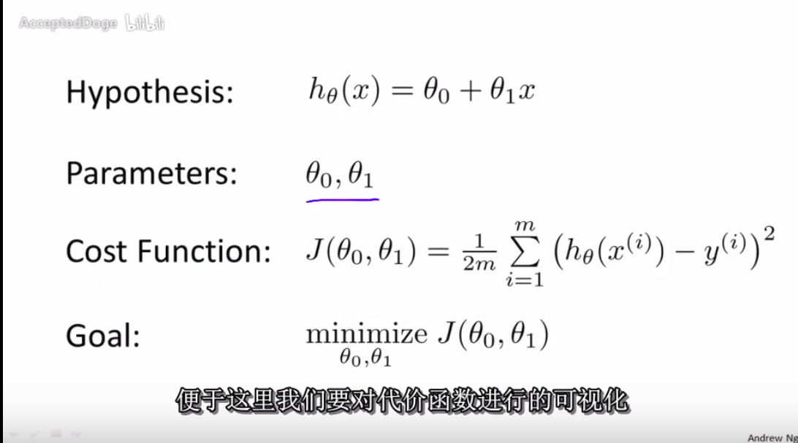
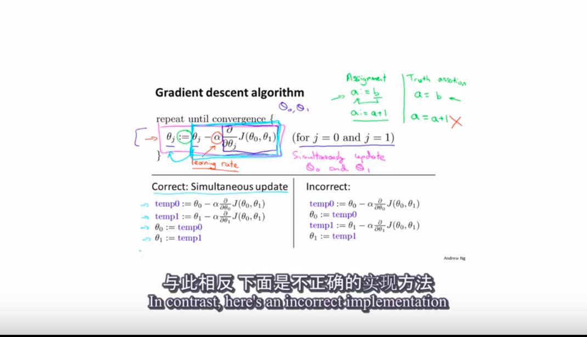
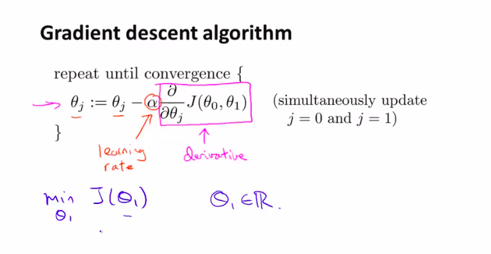
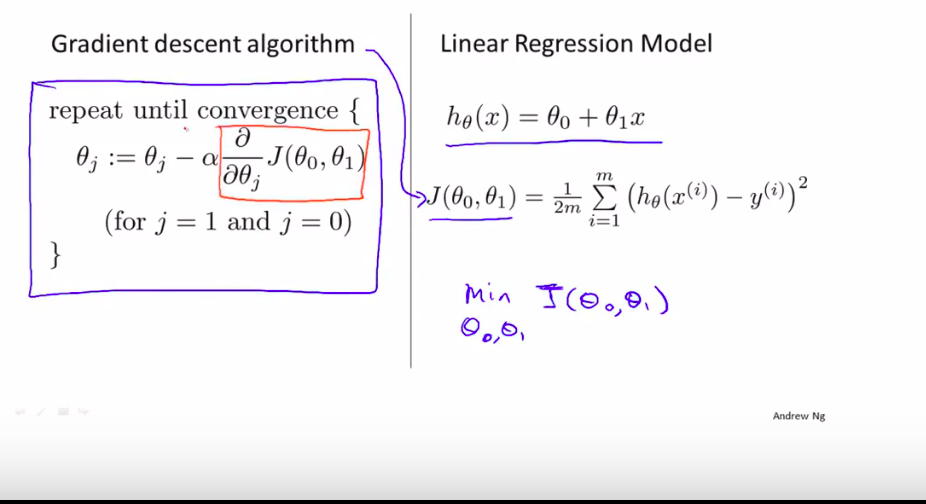
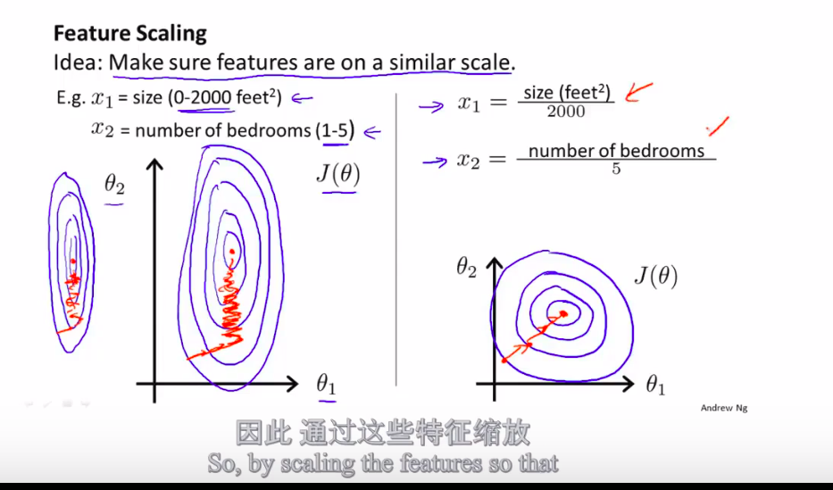
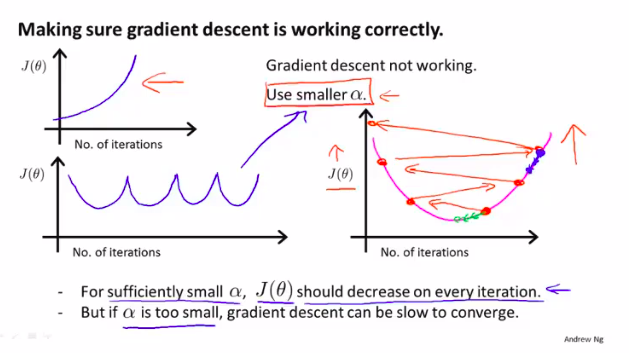
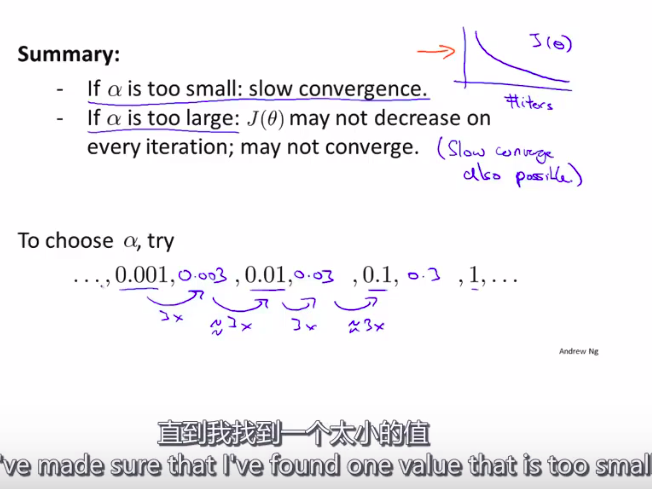
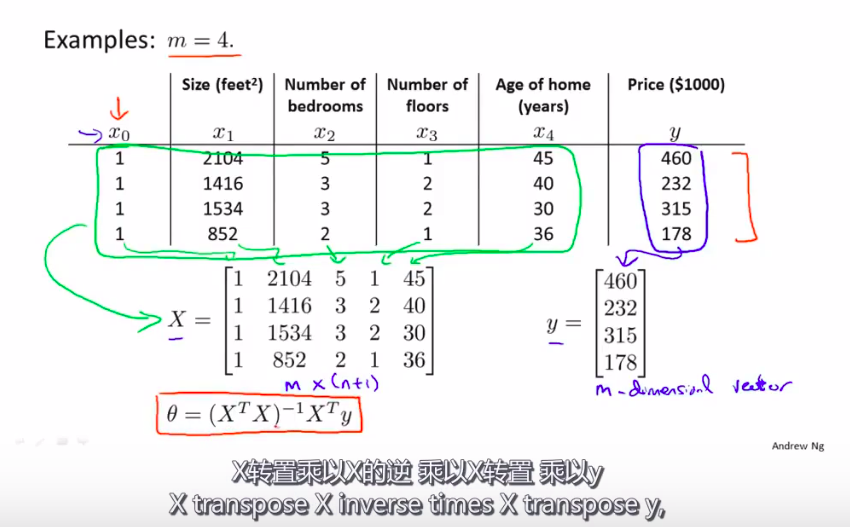

### 2.2 损失函数

### 2.3 梯度下降

线性回归的梯度下降
 

***
***

## 4 多元线性
#### 4.1 feature scaling（归一化）
数据的归一化处理的重要性
$$ x_i \leftarrow \frac{x_i - u_i}{s_i} $$

#### 4.2 learning rate choose

#### 4.3 feature choose

#### 4.4 normal equration

$$ X \theta = y $$
$$ X^{T} X \theta = y $$
$$ \theta = [ X^{T} X ] ^{-1} X^{T} y $$